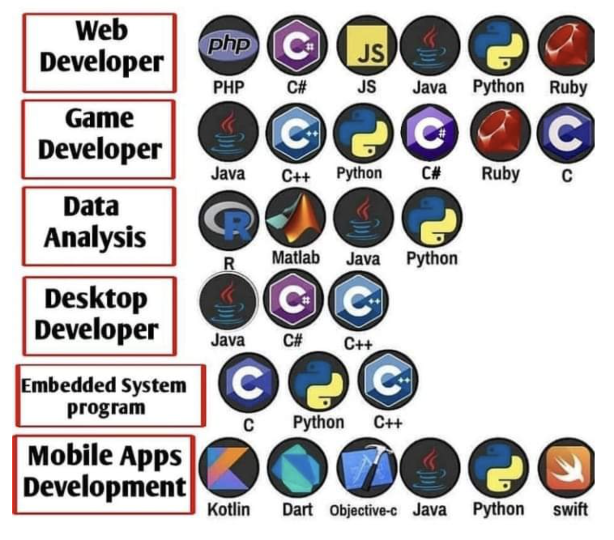

### 위시켓 
[위시켓 이용시 피해야할 프로젝트](https://okky.kr/article/406200) 
[경력자 위시켓 입문기](https://sosohanya.tistory.com/41) 
[부업으로 위시켓 프로젝트 개발](https://eastflag.co.kr/wishket/)

### Programming langauge

### react.js vue.js vuetify.js jQuery

react.js와 vue.js는 web에 frontend로 화면과 UI를 구성해주는 javascript 라이브러리다. react.js는 라이브러리에 속하고 vue.js는 라이브러리이지만 프레임워크에 가깝다. 사용성과 편리성은 vue.js가 좋지만 범용성은 react.js가 뛰어나다. react.js는 반응형이고 

jQuery도 javascript library 또는 framework라고 불리는데, 화면 속 기능을 보다 편리하게 구현할 수 있게 해준다.

[react.js와 vue.js 차이](https://brunch.co.kr/@skykamja24/573) 

## WEB AND APP

### React-native vs Flutter

### 워드프레스(wordpress) Cafe24 

### Kotlin and Java

### Swift and Objective-C

### GraphQL

### Crawling scarping

### sqlite mysql mariaDB mongoDB oracle

### SDK: software development kit

### PHP node.js 

### Django vs Flask

### Liquid template vs jinja template

### Zeplin Jira

### Chart.js

### Angular

웹개발 오픈소스이며 SPA(Single Page Application) 방식의 프론트엔드 개발을 위한 자바스크립트 프레임워크다. ngular는 AngularJS의 후속 버전으로, 2016년 9월, Angular 2 버전 (공식적으로 Angular 2 버전 이상을 Angular라고 부르고 Angular1 은 AngularJS로 부릅니다)이 처음 공개되었습니다.

### Spring and Spring boot

spring은 자바 언어로 구성된 앱을 위한 프레임워크다. 고전적인 프레임워크에 비해서 더 쉽기에 웹 발전에 기여했다. spring boot는 spring의 모든 특징을 다 사용할 수 있고 더 쉽게 설계되어 있다. spring boot는 spring 상단에 내재되어 있다. 

### WAS Web-server WSGI

### .NET

## INFRA

### Docker vs Kubernetes

### Cloud AWS Azure GCP

### MVP: Minimum Viable Product

프로토타입 제품으로 시험적으로 만든 것을 뜻한다.

### ERP: Enterprise Performance Management or Enterprise resource planning

[oracle - ERP 설명](https://www.oracle.com/kr/erp/what-is-erp/)

## DATA SCIENCE

### Snowflake Databrick

### Data infra

[한밀 - MAD trend](https://hmdev.vercel.app/2021%EB%85%84-Machine-Learning,-AI-and-Data-(MAD)-%ED%8A%B8%EB%A0%8C%EB%93%9C)

### Data mesh

## Macelleous

### SEO: Search Engin Optimization

구글이나 네이버와 같은 검색 엔진의 품질을 올리기 위해 최적화하는 것을 말한다.

